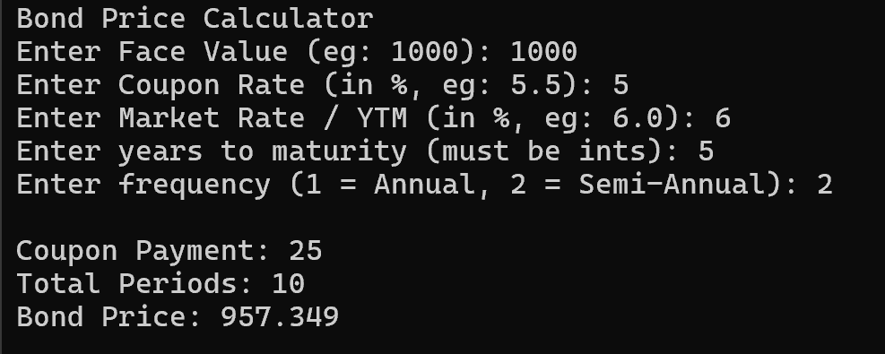

# Bond Price Calculator (C++)



A robust command-line program written in C++ that calculates the present value (price) of a fixed-rate coupon bond.

---

## Features & Error Handling

Unlike very basic calculators, this program includes input validation to keep results sensible and avoid common C++ input bugs:

- **Input Validation**  
  Ensures all financial inputs are sensible:
  - Face Value must be **positive**  
  - Coupon Rate must be **non-negative**  
  - Market Rate (YTM) must be **strictly greater than 0**

- **Zero-Division Protection**  
  Prevents using a zero or negative market rate, which would break the maths in the discounting formula.

- **Integer Fields with Decimal Protection**  
  For fields that must be whole numbers (like **Years** and **Frequency**), the program:
  - Reads into a `double`  
  - Checks if the value is a whole number (`value == floor(value)`)  
  - Only then casts to `int`  

  This cleanly catches cases like `5.5` for Years and asks the user to re-enter a valid **whole** number.

- **Type Safety & Infinite Loop Prevention**  
  If the user types something that isn’t numeric (e.g. `abc`), the program:
  - Detects the failed `cin` read  
  - Calls `cin.clear()` to reset the error state  
  - Calls `cin.ignore(...)` to flush the bad input from the buffer  
  - Prompts the user again  

  This prevents `cin` from getting stuck in a fail state and avoids infinite loops.

---

## How the formula works

The bond price is calculated as the **present value of all coupon payments** plus the **present value of the face value**:

\[
P = C \cdot \frac{1 - (1 + r)^{-n}}{r} + \frac{F}{(1 + r)^n}
\]

Where:

- \(P\) = bond price  
- \(C\) = coupon payment **per period**  
- \(r\) = discount rate **per period** (market yield / frequency)  
- \(n\) = total number of coupon periods (years × frequency)  
- \(F\) = face (par) value of the bond  

In the code:

- `couponRate` and `marketRate` are entered in **percent** (eg: 5.5 for 5.5%).  
- They are converted to decimals and adjusted for the coupon frequency.
---

## How to Compile & Run

This project uses only standard C++ libraries: `iostream`, `cmath`, and `limits`.

### 1. Compile

Using `g++`:

```bash
g++ main.cpp -o main
```

On Windows, you may want a self-contained executable (no missing-DLL errors). In that case:

```bash
g++ main.cpp -o main -static-libstdc++ -static-libgcc
# or, if you prefer:
# g++ main.cpp -o main -static
```

### 2. Run

```bash
# Windows
main.exe

# macOS / Linux
./main
```

## Inputs

The program prompts the user step-by-step for:

- **Face Value**  
  The par value of the bond (e.g. `1000`).

- **Coupon Rate (%)**  
  The **annual** coupon rate in percent (e.g. `5.5` for 5.5%).

- **Market Rate / YTM (%)**  
  The investor’s required return or yield to maturity in percent (e.g. `6.0`).

- **Years to Maturity**  
  Must be a **positive whole number** (e.g. `5`).

- **Frequency**  
  Coupon payment frequency:
  - `1` = Annual  
  - `2` = Semi-Annual  


## Example Run

```text
Bond Price Calculator
Enter Face Value (eg: 1000): 1000
Enter Coupon Rate (in %, eg: 5.5): 5
Enter Market Rate / YTM (in %, eg: 6.0): 6
Enter years to maturity (must be ints): 5
Enter frequency (1 = Annual, 2 = Semi-Annual): 1

Coupon Payment: 50
Total Periods: 5
Bond Price: 957.876
```
